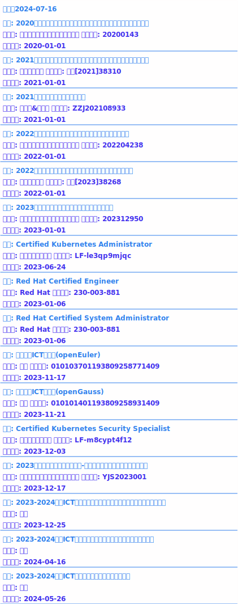

<h1 align="center">Hi 👋, I'm 王书展</h1>
<h3 align="center">A Chinese young man who often participates in skills competitions in vocational colleges</h3>

<h3 align="left">My certificate:</h3>
<picture>
  <source
    srcset="certs-dark.svg"
    media="(prefers-color-scheme: dark)"
  />
  <source
    srcset="certs.svg"
    media="(prefers-color-scheme: light), (prefers-color-scheme: no-preference)"
  />
  
</picture>

<h3 align="left">Languages and Tools:</h3>

                   

