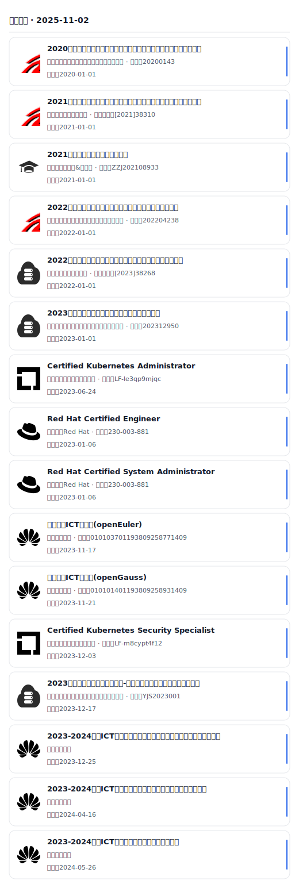
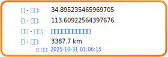
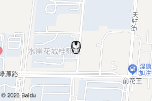

  🌐 Language: 
  <a href="#zh">中文</a> | 
  <a href="#en">English</a>

---

<b>中文版</b>

<h1 align="center">Hi 👋，我是 王书展</h1>
<h3 align="center">一名常参加职业院校技能竞赛的中国学生</h3>

  热爱开源与自动化，专注于 <b>云原生</b>、<b>DevOps</b>、<b>后端开发</b> 与 <b>运维工程</b>。  
  欢迎交流与指正！

<b>English Version</b>

<h1 align="center">Hi 👋, I'm Shuzhan Wang</h1>
<h3 align="center">A student from China, active in vocational skill competitions</h3>

  Passionate about <b>open source</b> and <b>automation</b>.  
  Focused on <b>cloud-native</b>, <b>DevOps</b>, <b>backend development</b>, and <b>SRE/operations</b>.

---

### 🎓 Certificates & 🛠️ Skills

<table>
<tbody>
<tr>
<td width="520" valign="top">

<h4>📜 Certificates</h4>

<picture>
  <source srcset="data/certs-dark.svg" media="(prefers-color-scheme: dark)" />
  <source srcset="data/certs-light.svg" media="(prefers-color-scheme: light), (prefers-color-scheme: no-preference)" />
  
</picture>

</td>
<td width="340" valign="top">

<h4>🛵 SMART CAR</h4>

<picture>
  <source srcset="data/ebike-location-dark.svg" media="(prefers-color-scheme: dark)" />
  <source srcset="data/ebike-location-light.svg" media="(prefers-color-scheme: light), (prefers-color-scheme: no-preference)" />
  
</picture>

<h4>🔧 Skills</h4>

<strong>Languages</strong>

<table>
<tbody>
<tr>
  <td></td>
  <td></td>
  <td></td>
  <td></td>
</tr>
<tr>
  <td></td>
  <td></td>
</tr>
</tbody>
</table>

<strong>Databases</strong>

<table>
<tbody>
<tr>
  <td></td>
  <td></td>
  <td></td>
  <td></td>
</tr>
<tr>
  <td></td>
</tr>
</tbody>
</table>

<strong>Frameworks</strong>

<table>
<tbody>
<tr>
  <td></td>
  <td></td>
</tr>
</tbody>
</table>

<strong>DevOps & Tools</strong>

<table>
<tbody>
<tr>
  <td></td>
  <td></td>
  <td></td>
  <td></td>
</tr>
<tr>
  <td></td>
  <td></td>
  <td></td>
</tr>
</tbody>
</table>

</td>
</tr>
</tbody>
</table>

---
